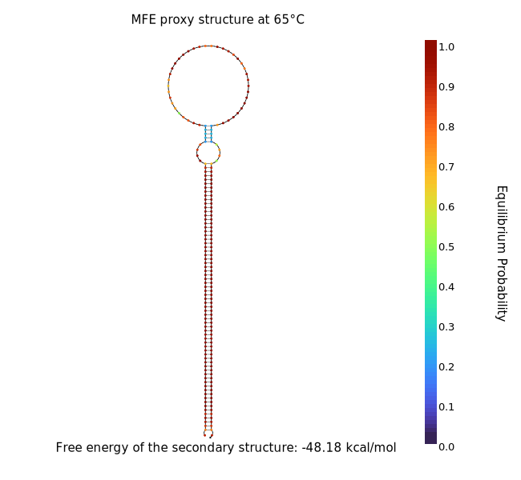

# hissPCR

Analysis primer design and alanysis for hisPCR (link to protocols.io). 


## hisPCR_primer_designer.sh
This program will design primers for a hissPCR reaction.
| Flag              | Description                                                       |
|-------------------|-------------------------------------------------------------------|
|  -n\|--name | name for amplicons (default | hisPCR_nameless) |
|  -c\|--seq_cycles | Illuina sequecnign cycles (read length; default | 250) |
|  -h\|--calc_hairpin | should the structure of the inner amplicon be caluclated, require seqfold and take significant time. Alternatively see  |NuPack and DINAmelt.
|  -start\|--start | start position for region of intrest on template (REQUIRED) |
|  -end\|--end | end position for region of intrest on template (REQUIRED) |
|  -t\|--template | template sequence (REQUIRED) |
|  -o\|--out_dir | path to output directory |
|  -s\|--Script_dir | path to script directory |

>hisPCR_primer_designer.sh \
>  --name "rpob_demo" \
>  --seq_cycles 300 \
>  --start 100 \
>  --end 800 \
>  --template "ttgaccgatgaccccggttcaggcttcaccacagtgtggaacgcggtcgtctccgaacttaacggcgaccctaaggttgacgacggacccagcagtgatgctaatctcagcgctccgctgacccctcagcaaagggcttggctcaatctcgtccagccattgaccatcgtcgaggggtttgctctgttatccgtgccgagcagctttgtccaaaacgaaatcgagcgccatctgcgggccccgattaccgacgctctcagccgccgactcggacatcagatccaactcggggtccgcatcgctccgccggcgaccgacgaagccgacgacactaccgtgccgccttccgaaaatcctgctaccacatcgccagacaccacaaccgacaacgacgagattgatgacagcgctgcggcacggggcgataaccagcacagttggccaagttacttcaccgagcgcccgcacaataccgattccgctaccgctggcgtaaccagccttaaccgtcgctacacctttgatacgttcgttatcggcgcctccaaccggttcgcgcacgccgccgccttggcgatcgcagaagcacccgcccgcgcttacaaccccctgttcatctggggcgagtccggtctcggcaagacacacctgctacacgcggcaggcaactatgcccaacggttgttcccgggaatgcgggtcaaatatgtctccaccgaggaattcaccaacgacttcattaactcgctccgcgatgaccgcaaggtcgcattcaaacgcagctaccgcgacgtagacgtgctgttggtcgacgacatccaattcattgaaggcaaagagggtattcaagaggagttcttccacaccttcaacaccttgcacaatgccaacaagcaaatcgtcatctcatctgaccgcccacccaagcagctcgccaccctcgaggaccggctgagaacccgctttgagtgggggctgatcactgacgtacaaccacccgagctggagacccgcatcgccatcttgcgcaagaaagcacagatggaacggctcgcggtccccgacgatgtcctcgaactcatcgccagcagtatcgaacgcaatatccgtgaactcgagggcgcgctgatccgggtcaccgcgttcgcctcattgaacaaaacaccaatcgacaaagcgctggccgagattgtgcttcgcgatctgatcgccgacgccaacaccatgcaaatcagcgcggcgacgatcatggctgccaccgccgaatacttcgacactaccgtcgaagagcttcgcgggcccggcaagacccgagcactggcccagtcacgacagattgcgatgtacctgtgtcgtgagctcaccgatctttcgttgcccaaaatcggccaagcgttcggccgtgatcacacaaccgtcatgtacgcccaacgcaagatcctgtccgagatggccgagcgccgtgaggtctttgatcacgtcaaagaactcaccactcgcatccgtcagcgctccaagcgctag"


To confirm the harpin formation at the desired anneling temprature, the following toold can be used insted of the `--calc_hairpin` flag, using the input primers and tails 'AATGATACGGCGACCACCGAGATCTACAC[i5 index]GACTGGAGTTCAGACGTGTGCTCTTCCGATCT - gene specific primers and insert - AGATCGGAAGAGCACACGTCTGAACTCCAGTC[i5 index]GTGTAGATCTCGGTGGTCGCCGTATCATT'

- [NuPack](https://www.nupack.org/analysis/input)
- [DINAmelt](http://www.unafold.org/Dinamelt/applications/quickfold.php)




## hissPCR.sh
The program will trim off the primer sequences (so they do not interfere with variant calling), produce numerous plots of the data, and calls variants. Outputs will be output in the current working directory.

>bash hissPCR.sh \
>  --R1 "test_data/read_R1_001.fastq.gz" \
>  --R2 "test_data/read_R2_001.fastq.gz" \
>  --ref "refs/BDQ_duplex.fasta" \
>  --primers "refs/primers.bed"


| Flag              | Description                                                       |
|-------------------|-------------------------------------------------------------------|
| -t\|--threads     | number of threads (def = 1)                                       |
| -n\|--sample_name | sample name (def = ${R1/R1*/})                                    |
| -1\|--R1          | path to read 1 (required)                                         |
| -2\|--R2          | path to read 2 (required)                                         |
| -f\|--ref         | path to reference fasta (required)                                |
| -p\|--primers     | path to file containin primer sequences (optinal but recommended, require samtools ≥v1.4) |
| -d\|--script_dir  | path to script dir (def = posix calculated)                       |
| -o\|--out_dir     | path to output dir (def = cwd)                                    |


#### Primers bed file
This file is highly recommended as otherwise primers will be used to call variants (or the lack of variants)
The file must contain thee columns, in the first, the chromosome name matching the name in the reference fasta file, second, the start of where this primer binds to the reference sequence, and third, when the binding ends.
for example

>$cat primers.bed

```
Rv0678	0	20
Rv0678	421	441
Rv0678	459	479
Rv0678	967	987
```


## Required software
These can be installed on linux systems by running 
>./install.sh

- [samtools >=1.4](http://www.htslib.org/download/)
- [bcftools >=1.4](http://www.htslib.org/download/)
- [bwa >= 0.7.17](https://sourceforge.net/projects/bio-bwa/files/)
- [bedtools](https://bedtools.readthedocs.io/en/latest/content/installation.html)
– [primer3](https://github.com/primer3-org/primer3)
– [seqfold](https://github.com/Lattice-Automation/seqfold)

R packages
- vcfR
- tidyverse
- ggplot2
- cowplot
- plotly
- htmlwidgets
